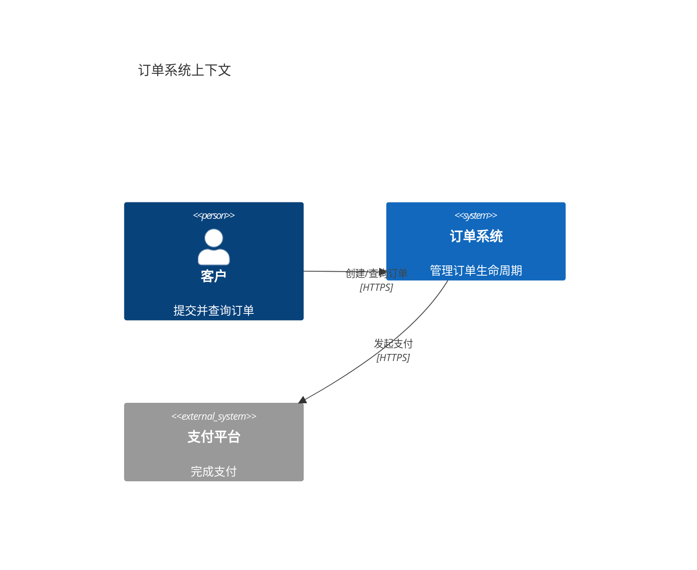

# C4 绘图规范

## 层级
- **系统上下文**：系统、用户及外部系统；用于说明范围。
- **容器**：可独立运行或部署的应用、数据存储；用于说明高层技术职责。
- **组件**：单个容器内部的主要模块；仅在需要指导实现时绘制。
- **代码**：通常由代码工具生成，不手工维护。

## 规则
1. 一张图只回答一个问题，并写明标题、范围和受众。
2. 每个元素标注名称、类型和一句职责；关系使用有方向的动词，并按需标注协议。
3. 不把队列、数据库误画为软件系统；容器不是 Docker 的同义词。
4. 保持层级一致；跨层元素仅在理解确有必要时出现并明确标注。
5. 图中名称必须与正文、代码和其他层级一致；必要时附图例。

## Mermaid 示例

若目标渲染器不支持 C4 语法，改用 `flowchart`，仍遵循上述语义。
